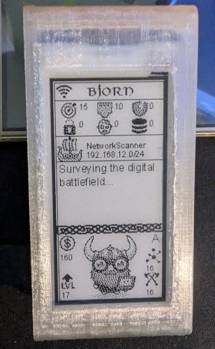
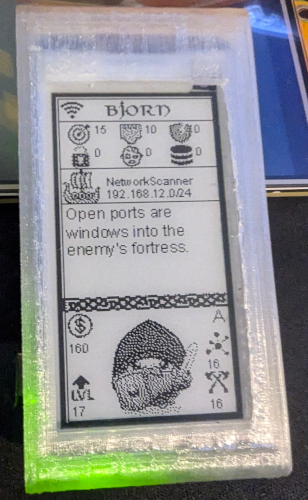
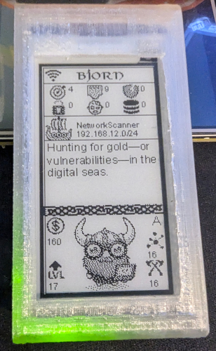
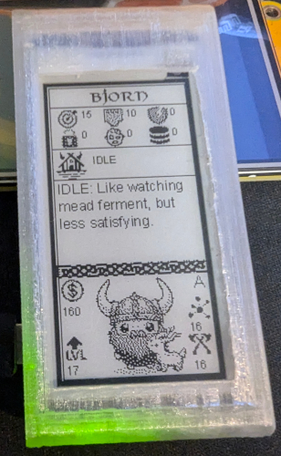

  <h1>Comments</h1>

 
 

## ⬆ Update Highlights 11/19/24 ⬆   Added install script
I have developed a streamlined installation script to simplify the setup process with minimal user input.
 
To use it:
 
Download the install_comments.sh script and transfer it to the /home/bjorn directory on your Raspberry Pi. Tools like FileZilla or similar file transfer software are recommended for this step.
Open an SSH terminal (e.g., PuTTY) and execute the following commands:
 
- chmod +x install_comments.sh
- sudo ./install_comments_fixed.sh

---
## Manual installation
To use the file you must remove the "Viking-Styled-" and just leave comments. Make sure it stays as a .json file.
 

To upload the file, on a windows pc download or open filezilla and connect to your bjorn using the credentials 
you setup during installation of bjorn. the address should be bjorn.local
 

If you need to use the ip address of bjorn instead of the hostname, then scan your network and locate his ip address
 

Once your logged into your bjorn navigate to /home/bjorn/Bjorn/resources/comments and make a backup of the original comments.json file to your pc and then upload the viking themed comments json to the folder. (Remember to rename the file)
 

It will ask you to overwrite, hit yes and then go reboot your bjorn in the webui of bjorn. 

 

### I'm also working a writeup on how to edit/change the .json file for comments as you must keep the structure intact.

---

🌐 Community
 
Join the Bjorn community to share ideas and get updates:
 
Connect with others on the bjorn Discord server.
Report issues or suggest features on GitHub.