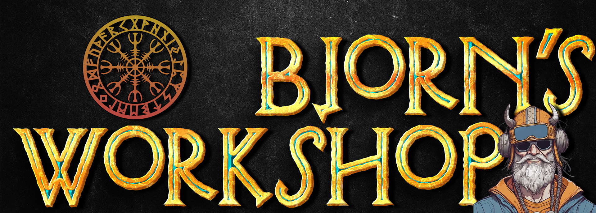

 

  ---
  

  <h1>Bjorns-Workshop</h1>

Bjorns-Workshop is a community-driven repository for customizations, enhancements, and resources designed to extend the capabilities of Bjorn, the autonomous, Tamagotchi-like tool for network scanning and vulnerability assessment. 
As the project (bjorn) grows and the knowledge base surrounding the structure, code, functions and more grows the will be more stuff added to each section. 

  

🌟 About Bjorn:
 
Bjorn is an autonomous security companion that automates network scanning to identify devices and vulnerabilities.
Adapts its behavior dynamically based on scan results.
Offers a Tamagotchi-like interface, blending functionality and fun.
Runs on lightweight hardware, such as a Raspberry Pi zero with a 2.13-inch e-Paper HAT.
This repository enables the community to expand, enhance, and customize Bjorn, ensuring it evolves into an even more customizable tool. 
**More about Bjorn can be found <a href=https://github.com/infinition/Bjorn>HERE</a>**

🎨Theming Bjorn to match your preferences:
 
Change the visual appearance, animations, fonts, comments and more.

🚀 Boost Bjorn’s functionality with: (Coming Soon)
 
Learn how to adjust interaction levels, scan frequencies, behaviors and more.
New actions, additional protocols, attacks and tools .
Advanced Reporting, to possibly visualize data or generate better in-depth reports.
Possible workflow Optimization to handle larger and more complex networks.

🌐 Community
 
Join the Bjorn community to share ideas and get updates:
 
Connect with others on the bjorn Discord server.
Report issues or suggest features on GitHub.
