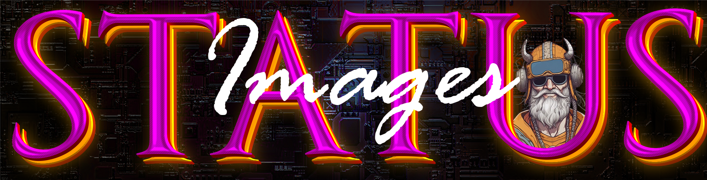

  <h1>Status Images & Icons</h1>

 

## Custom Images

---
## Manual installation

 

To upload the file, on a windows pc download or open filezilla and connect to your bjorn using the credentials 
you setup during installation of bjorn. the address should be bjorn.local
 

If you need to use the ip address of bjorn instead of the hostname, then scan your network and locate his ip address
 

Once your logged into your bjorn navigate to /home/bjorn/Bjorn/resources/XXXXXXX and make a backup of the original comments.json file to your pc and then upload the viking themed comments json to the folder. (Remember to rename the file)
 

It will ask you to overwrite, hit yes and then go reboot your bjorn in the webui of bjorn. 

 

---

🌐 Community
 
Join the Bjorn community to share ideas and get updates:
 
Connect with others on the bjorn Discord server.
Report issues or suggest features on GitHub.